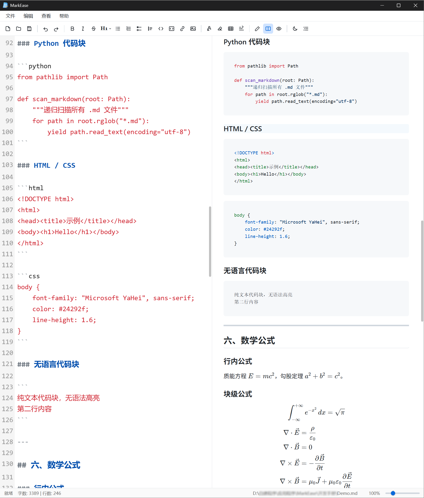
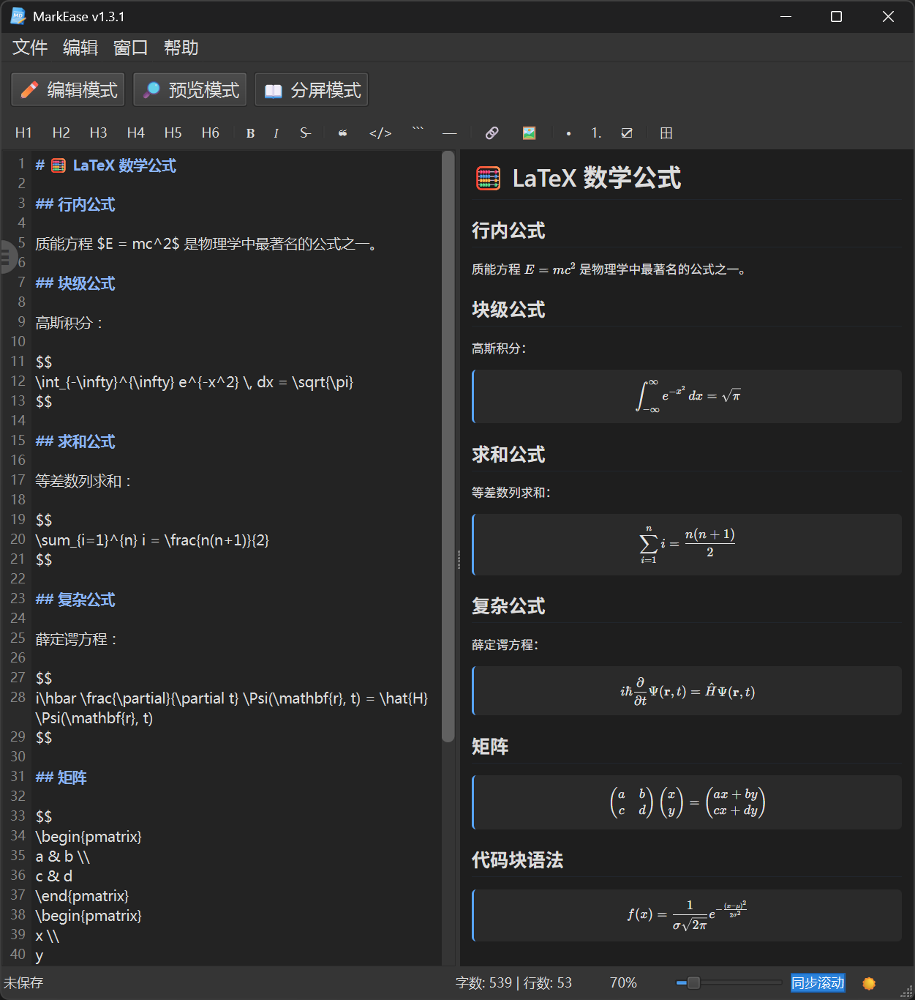

# 📝 MarkEase

> 一款运行于 Windows 平台、**完全离线**、轻量级的 GitHub 风格 Markdown 编辑器

[](https://github.com/zbt00123/MarkEase/releases)
[](LICENSE)
[](https://github.com/zbt00123/MarkEase/releases)

> ⚠️ **杀毒软件可能会误报，请将 `MarkEase.exe` 添加信任。**

---

## ✨ 核心特性

### 📝 编辑体验
- **三种模式**：编辑 / 预览 / 分屏，随心切换
- **任务列表交互**：点击 `- [ ]` / `- [x]` 一键切换，支持多行批量处理
- **多行格式编辑**：选中多行时自动为每行添加前缀，代码块包裹整个选区
- **智能工具栏**：一键插入标题、加粗、斜体、链接、表格等
- **实时字数统计**：随时掌握文档规模

### 🎨 视觉与主题
- **多主题支持**：浅色 / 深色 / 跟随系统
- **代码语法高亮**：自动匹配 CSS、JavaScript、HTML、XML、Markdown、Shell、Visual Basic 等
- **CSV 智能高亮**：表头 / 数字 / 字符串 / 分隔符分色显示
- **LaTeX 数学公式**：支持 `$行内$`、`$$块级$$` 及 ` ```math ` 代码块
- **深浅主题联动**：代码、公式、CSV 全部随主题自动切换

### 🛡️ 安全防护
- **双层防御**：Markdown 原始 HTML 转义 + DOM 白名单过滤
- **XSS 拦截**：屏蔽 `<script>`、`<iframe>`、`<svg>`、`onerror`、`javascript:` 等注入攻击

### 🌍 多语言支持
- 简体中文、繁體中文、English、한국어、日本語

### 📑 文档导航
- **智能目录**：自动解析标题，悬浮按钮快速呼出
- **同步滚动**：编辑与预览区域滚动同步
- **目录高亮**：当前章节自动高亮

### 🔍 查找与预览
- **查找替换**：支持大小写匹配、全词匹配，编辑器和预览均支持
- **GitHub 徽章**：联网状态下完美渲染 `img.shields.io` 等在线徽章

### 📐 缩放与布局
- **缩放控制**：10%–500%，编辑器和预览同步缩放
- **分屏比例可调**：自由拖拽调整编辑 / 预览比例

### 🔄 更新与集成
- **自动检查更新**：启动后每月自动检查新版本
- **手动检查**：随时查询 GitHub 最新版本
- **文件关联**：支持设为 `.md` / `.markdown` 默认程序

### 💻 完全离线
- 不依赖网络，保护隐私
- 所有资源本地加载，无需联网即可使用

---

## 🖼️ 界面预览

| 模式 | 截图 |
|:---:|:---:|
| 编辑模式 |  |
| 分屏模式 |  |
| 预览模式 |  |
| 代码高亮 |  |
| 数学公式 |  |

---

## 🚀 快速开始

### 📦 下载使用

1. 前往 [Releases](https://github.com/zbt00123/MarkEase/releases) 下载最新版本
2. 解压 `MarkEase_vX.X.X_Windows_x64_portable.7z`
3. 双击运行 `MarkEase.exe` 即可

### 🧑‍💻 从源码运行

```bash
git clone https://github.com/zbt00123/MarkEase.git
cd MarkEase
pip install -r requirements.txt
python main.py
```

---

## 🛠️ 技术栈

| 组件 | 技术 |
|------|------|
| GUI 框架 | PySide6 (Qt for Python) |
| 预览渲染 | QWebEngineView |
| Markdown 解析 | marked.js |
| 代码高亮 | highlight.js |
| 数学公式 | KaTeX |
| 样式主题 | github-markdown-css |
| PDF 处理 | PyMuPDF |
| 打包工具 | PyInstaller |

---

## 📖 使用技巧

### ✅ 任务列表快速切换
点击 `- [ ]` 或 `- [x]` 一键切换；选中多行时统一切换。

### 📚 多行格式批量操作
选中多行后点击工具栏：
- **引用** → 每行加 `> `
- **无序列表** → 每行加 `- `
- **有序列表** → 每行加 `1. 2. 3. ...`
- **任务列表** → 每行加 `- [ ] `
- **代码块** → 三反引号包裹整个选区

### 🧮 数学公式
- 行内：`$a^2 + b^2 = c^2$`
- 块级：`$$ E = mc^2 $$`
- 代码块：`` ```math ``

### ⌨️ 预览快捷键
- 预览模式下按 `Ctrl+C` 复制选中内容
- 所有超链接自动在系统浏览器打开

---

## 🤝 贡献

欢迎提交 [Issue](https://github.com/zbt00123/MarkEase/issues) 和 [Pull Request](https://github.com/zbt00123/MarkEase/pulls)！

1. Fork 本仓库
2. 创建特性分支 (`git checkout -b feature/AmazingFeature`)
3. 提交更改 (`git commit -m 'Add some AmazingFeature'`)
4. 推送分支 (`git push origin feature/AmazingFeature`)
5. 打开 Pull Request

---

## 📄 许可证

本项目仅供学习使用，采用 MIT 许可证。详见 [LICENSE](LICENSE) 文件。

---

## 🙏 致谢

- [PySide6](https://pypi.org/project/PySide6/) — Qt for Python (LGPL)
- [PyMuPDF](https://pypi.org/project/PyMuPDF/) — PDF 处理 (AGPL)
- [marked.js](https://marked.js.org/) — Markdown 解析器 (MIT)
- [highlight.js](https://highlightjs.org/) — 代码高亮 (BSD-3-Clause)
- [KaTeX](https://katex.org/) — 数学公式渲染 (MIT)
- [KaTeX Fonts](https://github.com/KaTeX/katex-fonts) — 数学字体 (OFL-1.1)
- [github-markdown-css](https://github.com/sindresorhus/github-markdown-css) — GitHub 风格样式 (MIT)
- QWebChannel.js — Qt Web 通信组件 (LGPL)

> 详细许可信息见 [THIRD_PARTY_NOTICES.md](THIRD_PARTY_NOTICES.md)

---

**如果觉得不错，请给个 ⭐ Star 支持一下！**
