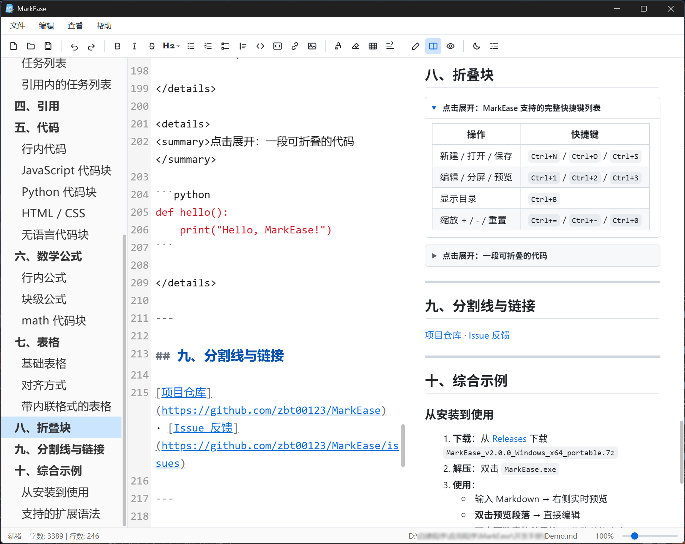
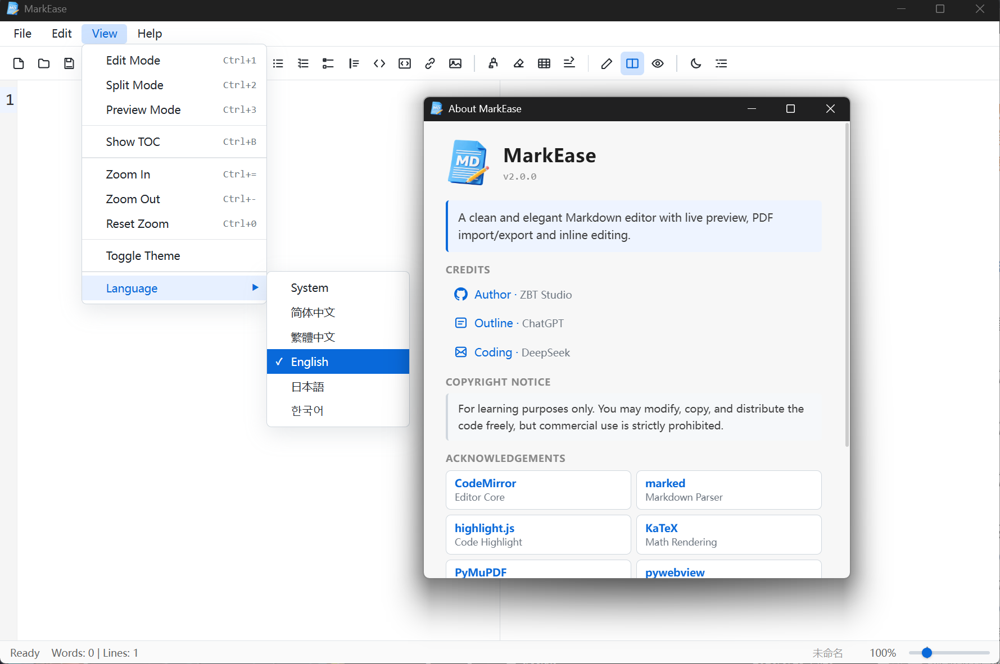

# 📝 MarkEase

> 一款运行于 Windows 平台、**完全离线**、GitHub 风格的 Markdown 编辑器

[](https://github.com/zbt00123/MarkEase/releases) [](LICENSE) [](https://github.com/zbt00123/MarkEase/releases)

> ⚠️ **杀毒软件可能误报**，请将 `MarkEase.exe` 添加信任。
> 本程序使用 WebView2 渲染，启动时已禁用其后台网络与组件更新；如仍告警，请加入白名单。

---

## 🎉 v2.0.0 全新发布

相比 **v1.3.1**，v2.0.0 是一次**架构级重构 + 功能大爆发**。

## ✨ 2.0.0 核心亮点

### ⚡ 强大的编辑体验

- **三模式切换**：编辑 / 分屏 / 预览（`Ctrl+1/2/3`）
- **CodeMirror 6 内核**：语法高亮、行号、多光标、事务级撤销
- **多行批量操作**：选中多行 → 加引用 / 列表 / 任务 / 代码块前缀
- **格式刷**：单击刷一次、双击连续刷
- **橡皮擦**：一键清除行内格式
- **折叠块**：选区包裹 `<details>`，折叠状态自动记忆
- **插入链接**：输入 URL → **自动抓取网页标题**
- **插入表格**：工具栏 8×8 网格可视化选择
- **插入图片**：本地 / 拖拽 / URL 三种方式，自动归类 `assets/`

### 📑 智能目录

- 自动解析标题
- 当前章节**滚动高亮**
- 点击跳转 → 编辑器与预览**同时定位**

### 🔄 精确同步滚动

基于**源位置映射算法**：每个块记录源码字符偏移，滚动时二分查找 + 线性插值。

即使遇到代码块、引用、表格等**行距差异巨大**的内容也能精确对齐。

### ✅ 任务列表交互

- **图形 checkbox**（CSS 绘制，不依赖字体）
- 预览区点击 → 立即同步源码
- **跨行批量**：选中多行 + 点击任一 checkbox → 全部切换
- **复制保真**：复制出来仍是 `- [x] / - [ ]` 原文

### 📊 表格编辑

- 工具栏网格选行列 → 快速插入标准 GFM 表格

### 🌍 多语言

- 简体中文 / 繁體中文 / English / 日本語 / 한국어

### 🔔 检查更新

- **手动**：帮助 → 检查更新
- **静默**：每30天自动检测更新

### 🎯 缩放与布局

- **10% – 500%** 缩放，编辑 / 预览同步
- 状态栏滑块支持**单击吸附**（90%–110% → 100%）
- 点击百分比 → **预设菜单**（50 / 75 / 100 / ... / 500）

### 📄 PDF 闭环

- **导入**：PyMuPDF 解析 → 自动转 Markdown
- **导出**：高清矢量 PDF
- **源嵌入**：PDF 内嵌原始 Markdown（`markease_source.md`）→ **可无损往返**

### 🖥️ 系统集成

- **设为默认程序**：帮助 → 设置 → 关联 `.md` / `.markdown`（写 HKCU，无需管理员）
- **右键「新建」菜单**：桌面右键 → 新建 → 「Markdown 文件」
- **文件定位**：点击状态栏路径 → 资源管理器打开并选中
- **拖拽导入**：拖图片 → 自动复制到 `assets/` 并插入引用
- **图片冲突**：同名文件弹窗对比（缩略图 + 大小），支持替换 / 保留两者

### 🛡️ 安全与隐私

- **双层 XSS 防御**：HTML 转义 + DOM 白名单
- **屏蔽危险标签**：`<script>` / `<iframe>` / `<svg>` 等一律剔除
- **禁用内联事件**：`onerror` / `onclick` 等属性全部剥离
- **URL 协议白名单**：`http / https / mailto / tel / file` 等
- **完全离线**：所有资源本地打包

---

## 🖼️ 界面预览

| 场景 | 截图 |
|:---:|:---:|
| 分屏模式 |  |
| 编辑模式 |  |
| 预览模式 |  |
| 代码高亮 + 数学公式 |  |
| 表格单元格编辑 |  |
| 任务列表 + 目录 |  |
| 多语言切换 |  |

---

## 🚀 快速开始

### 📦 下载使用

1. 前往 [Releases](https://github.com/zbt00123/MarkEase/releases) 下载
2. 解压 `MarkEase_v2.0.0_Windows_x64_portable.7z`
3. 双击 `MarkEase.exe`

> 首次启动会自动添加右键「新建 → Markdown 文件」项。
> 如需设为 `.md` 默认程序：**帮助 → 设置 → 设为默认打开程序**。

### 🧑‍💻 从源码运行

```bash
git clone https://github.com/zbt00123/MarkEase.git
cd MarkEase
pip install -r requirements.txt
python main.py
```


---

## 🛠️ 技术栈

| 组件 | 技术 |
|------|------|
| 桌面框架 | [pywebview](https://pywebview.flowrl.com/) (WebView2) |
| 编辑器内核 | [CodeMirror 6](https://codemirror.net/) |
| Markdown 解析 | [marked.js](https://marked.js.org/) |
| 代码高亮 | [highlight.js](https://highlightjs.org/) |
| 数学公式 | [KaTeX](https://katex.org/) |
| 预览样式 | [github-markdown-css](https://github.com/sindresorhus/github-markdown-css) |
| PDF 处理 | [PyMuPDF](https://pymupdf.readthedocs.io/) |
| PDF 导出 | pythonnet + WebView2 `PrintToPdfAsync` |
| 打包 | [PyInstaller](https://pyinstaller.org/) |

---

## ⌨️ 快捷键

| 操作 | 快捷键 |
|------|--------|
| 新建 / 打开 / 保存 | `Ctrl+N` / `Ctrl+O` / `Ctrl+S` |
| 另存为 | `Ctrl+Shift+S` |
| 撤销 / 重做 | `Ctrl+Z` / `Ctrl+Y` |
| 剪切 / 复制 / 粘贴 | `Ctrl+X` / `Ctrl+C` / `Ctrl+V` |
| 查找 / 替换 | `Ctrl+F` / `Ctrl+H` |
| 编辑 / 分屏 / 预览 | `Ctrl+1` / `Ctrl+2` / `Ctrl+3` |
| 显示目录 | `Ctrl+B` |
| 缩放 + / - / 重置 | `Ctrl+=` / `Ctrl+-` / `Ctrl+0` |
| 插入图片 | `Ctrl+Shift+I` |
| 退出 | `Ctrl+Q` |

---

## 📖 使用技巧

### ✅ 任务列表

- **单行**：点击 `- [ ]` / `- [x]` 切换
- **多行**：选中多行 + 点击任一 checkbox → 批量切换

### 📚 多行格式批量操作

选中多行后点工具栏：引用 / 无序列表 / 有序列表 / 任务列表 / 代码块。

> 任务列表按钮**只加前缀**，不改已有勾选状态。

### 🧮 数学公式

- 行内：`$a^2 + b^2 = c^2$`
- 块级：`$$ E = mc^2 $$`
- 代码块：```` ```math ````

### 📊 表格

- **插入**：工具栏表格图标 → 网格选行列
- **编辑**：预览区**双击单元格** → 直接改 → `Enter` 提交

### 🎯 折叠块

选中内容 → 工具栏折叠图标 → 变成 `<details>`，折叠状态自动记忆。

---

## 🤝 贡献

欢迎提交 [Issue](https://github.com/zbt00123/MarkEase/issues) 和 [Pull Request](https://github.com/zbt00123/MarkEase/pulls)。

---

## 📄 许可证

本项目仅供学习使用，采用 MIT 许可证。详见 [LICENSE](LICENSE)。

---

## 🙏 致谢

- [pywebview](https://pywebview.flowrl.com/) — 桌面窗口框架
- [CodeMirror 6](https://codemirror.net/) — 编辑器内核
- [marked.js](https://marked.js.org/) — Markdown 解析器
- [highlight.js](https://highlightjs.org/) — 代码高亮
- [KaTeX](https://katex.org/) — 数学公式渲染
- [github-markdown-css](https://github.com/sindresorhus/github-markdown-css) — GitHub 风格样式
- [PyMuPDF](https://pymupdf.readthedocs.io/) — PDF 处理
- [GitHub Octicons](https://github.com/primer/octicons) — 图标风格参考

> 详细许可信息见 [THIRD_PARTY_NOTICES.md](THIRD_PARTY_NOTICES.md)

---

**如果觉得不错，请给个 ⭐ Star 支持一下！**