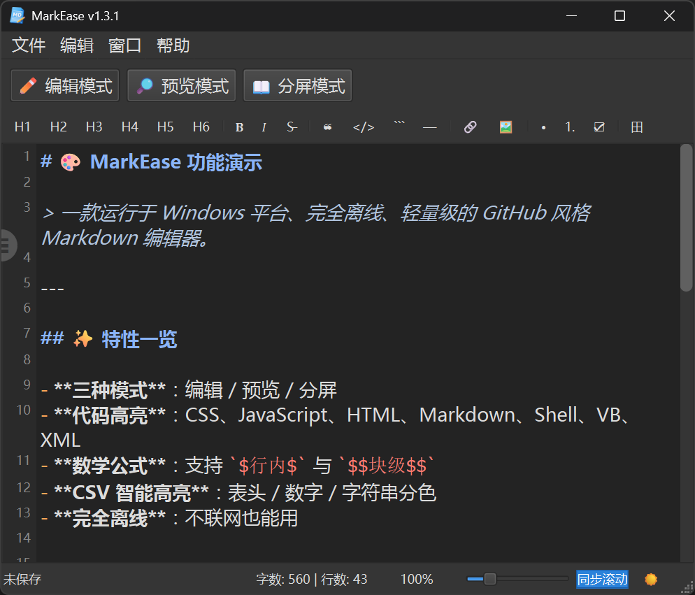
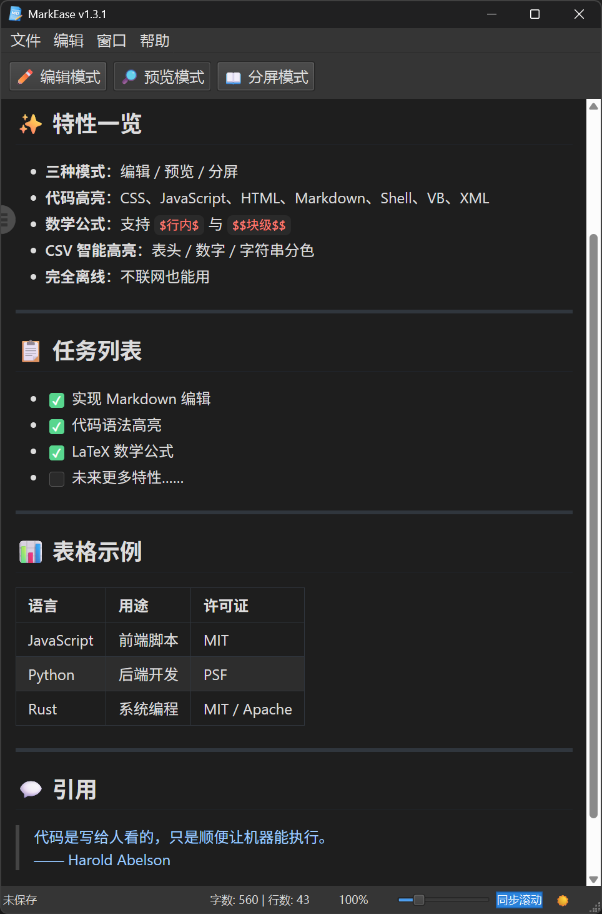

好的，以下是适用于 GitHub README 的 MarkEase 完整介绍，整合了 v1.2.2 版本的所有新特性：

---

# 📝 MarkEase

> 一款运行于 Windows 平台、完全离线、轻量级的 GitHub 风格 Markdown 编辑器

[](https://github.com/zbt00123/MarkEase/releases)
[](LICENSE)
[](https://github.com/zbt00123/MarkEase/releases)

---

## ✨ 核心特性

### 📝 编辑体验
- **三种编辑模式**：编辑 / 预览 / 分屏，随心切换
- **任务列表交互**：点击 `- [ ]` / `- [x]` 一键切换任务状态，支持多行批量处理
- **多行格式编辑**：选中多行时，引用、列表、任务列表自动为每行添加前缀，代码块包裹整个选区
- **智能格式工具栏**：一键插入标题、加粗、斜体、链接、表格等
- **实时字数统计**：随时掌握文档规模

### 🎨 视觉与主题
- **多主题支持**：浅色 / 深色 / 跟随系统，护眼舒适

### 🌍 多语言支持
- 简体中文、繁体中文、English、한국어、日本語

### 📑 文档导航
- **智能目录**：自动解析标题，支持悬浮按钮快速呼出
- **同步滚动**：编辑与预览区域滚动同步，精准定位
- **目录高亮**：当前章节在目录中自动高亮

### 🔍 查找与预览
- **查找替换**：支持大小写匹配、全词匹配，编辑器和预览均支持查找
- **GitHub 徽章支持**：联网状态下完美渲染 `img.shields.io` 等在线徽章

### 📐 缩放与布局
- **缩放控制**：10%–500%，编辑器和预览同步缩放
- **分屏比例可调**：自由拖拽分割器调整编辑/预览区域比例

### 🔔 更新与集成
- **自动更新检查**：启动后每月自动检查新版本
- **手动检查更新**：随时检查 GitHub 最新版本
- **文件关联**：支持设为 `.md` / `.markdown` 默认程序

### 💻 完全离线
- 不依赖网络，保护隐私
- 所有资源本地加载，无需联网即可使用

---

## 🖼️ 界面预览

| 模式 | 截图 |
|:---:|:---:|
| 编辑模式 |  |
| 分屏模式 |  |
| 预览模式 |  |

---

## 🚀 快速开始

### 下载安装

1. 前往 [Releases](https://github.com/zbt00123/MarkEase/releases) 下载最新版本
2. 解压 `MarkEase_vX.X.X_Windows_x64_portable.7z`
3. 双击运行 `MarkEase.exe` 即可使用

### 从源码运行

```bash
# 克隆仓库
git clone https://github.com/zbt00123/MarkEase.git
cd MarkEase

# 安装依赖
pip install -r requirements.txt

# 运行
python main.py
```

## 🛠️ 技术栈

| 组件 | 技术 |
|------|------|
| GUI 框架 | PySide6 (Qt for Python) |
| 预览渲染 | QWebEngineView |
| Markdown 解析 | marked.js |
| 代码高亮 | highlight.js |
| 样式主题 | github-markdown-css |
| 打包工具 | PyInstaller + Inno Setup |

---

## 📖 使用技巧

### 任务列表快速切换
- 在编辑器中点击 `- [ ]` 或 `- [x]` 标记，一键切换任务状态
- 选中多行任务后，点击任意一行的标记，所有选中行统一切换状态

### 多行格式批量操作
选中多行文本后，点击工具栏按钮：
- **引用**：每行自动添加 `> ` 前缀
- **无序列表**：每行自动添加 `- ` 前缀
- **有序列表**：每行自动添加 `1. 2. 3. ...` 前缀
- **任务列表**：每行自动添加 `- [ ] ` 前缀
- **代码块**：用三个反引号包裹整个选中区域

### 预览快捷键
- 预览模式下，直接按 `Ctrl+C` 复制选中内容
- 所有超链接自动在系统浏览器中打开

---

## 🤝 贡献

欢迎提交 [Issue](https://github.com/zbt00123/MarkEase/issues) 和 [Pull Request](https://github.com/zbt00123/MarkEase/pulls)！

1. Fork 本仓库
2. 创建您的特性分支 (`git checkout -b feature/AmazingFeature`)
3. 提交您的更改 (`git commit -m 'Add some AmazingFeature'`)
4. 推送到分支 (`git push origin feature/AmazingFeature`)
5. 打开一个 Pull Request

---

## 📄 许可证

本项目仅供学习使用，采用 MIT 许可证。详见 [LICENSE](LICENSE) 文件。

---

## 🙏 致谢

- [PySide6](https://pypi.org/project/PySide6/) — Qt for Python (LGPL)
- [marked.js](https://marked.js.org/) — Markdown 解析器 (MIT)
- [highlight.js](https://highlightjs.org/) — 代码高亮 (BSD-3-Clause)
- [github-markdown-css](https://github.com/sindresorhus/github-markdown-css) — GitHub 风格样式 (MIT)
- QWebChannel.js — Qt Web 通信组件 (LGPL)

---

**如果觉得不错，请给个 ⭐ Star 支持一下！**
