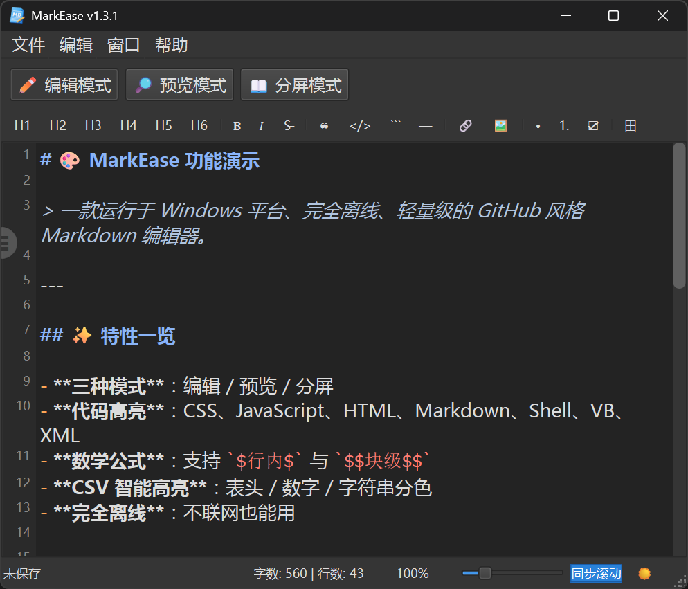
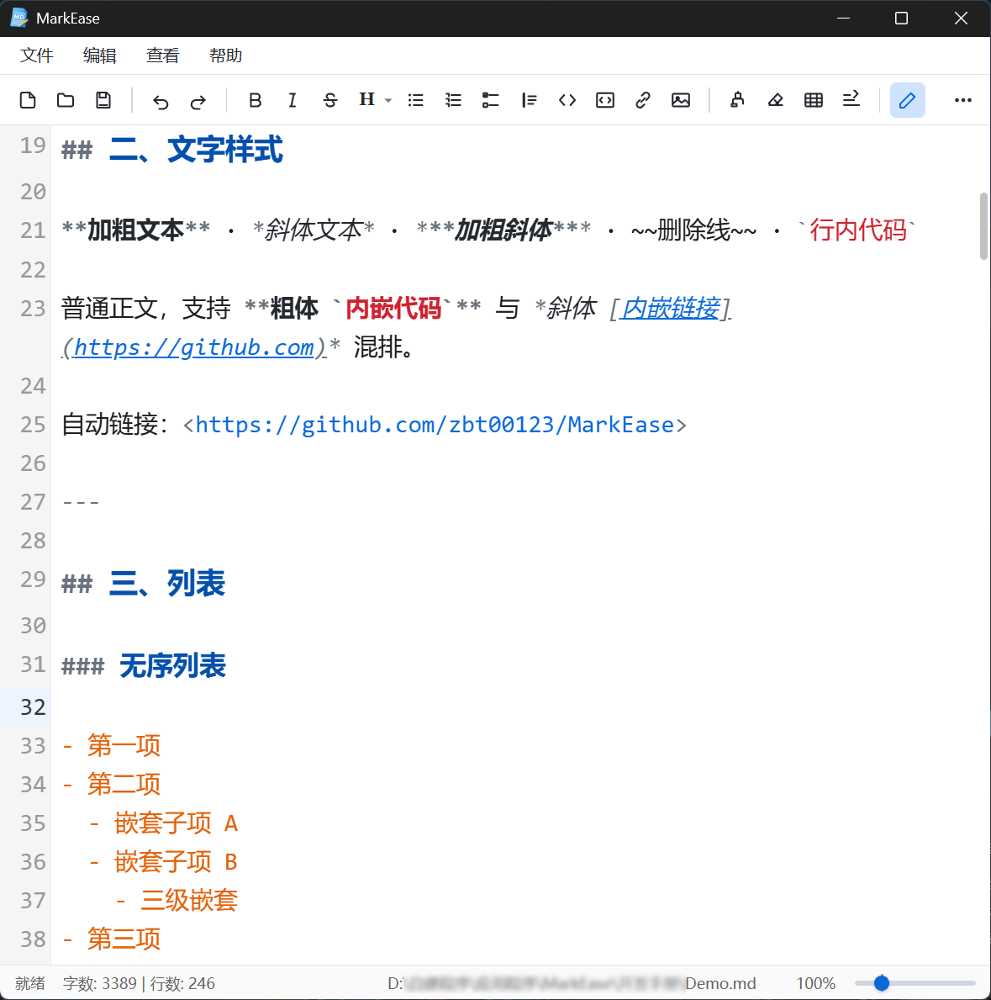
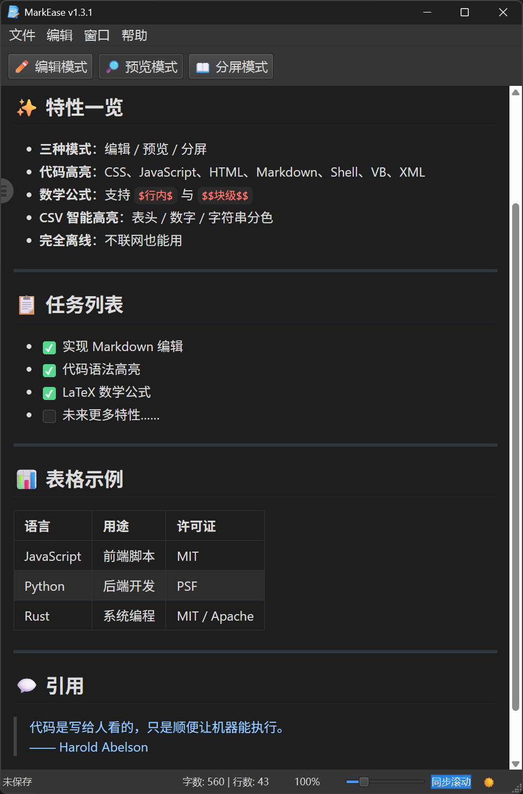
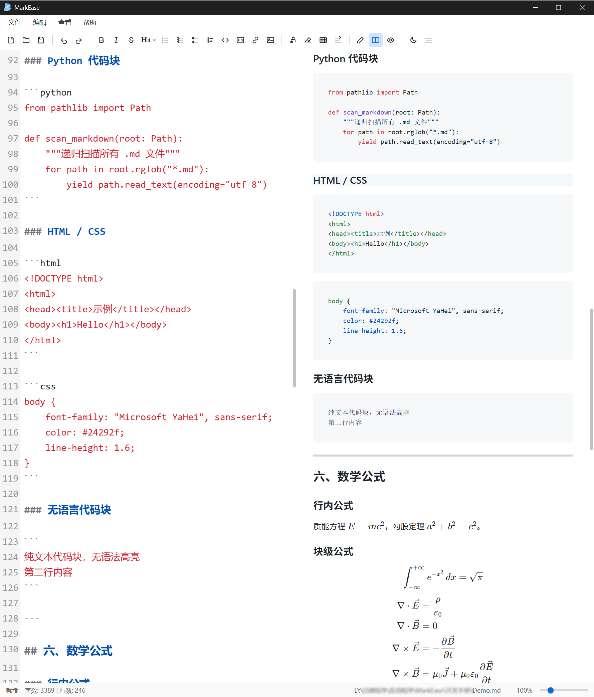
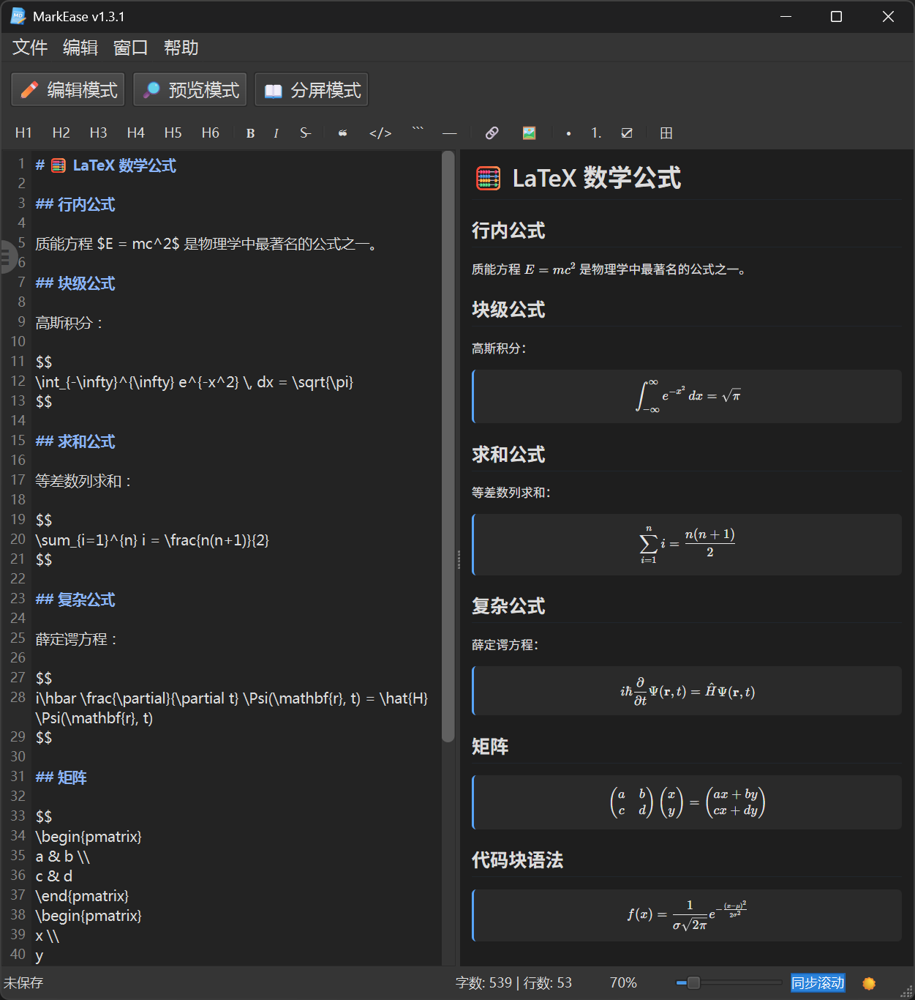
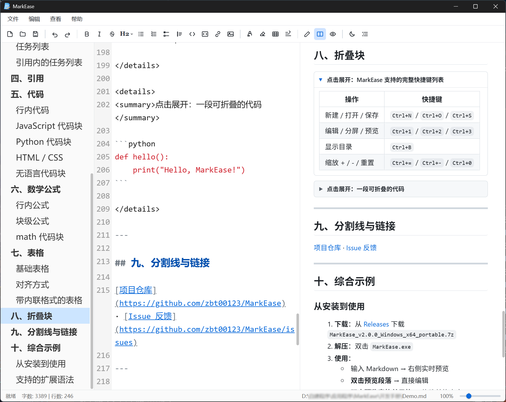
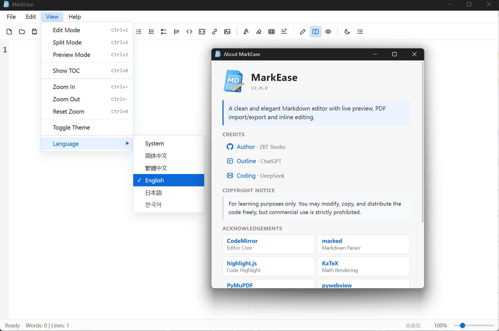

# 📝 MarkEase

> 一款运行于 Windows 平台、**完全离线**、GitHub 风格的 Markdown 编辑器

[](https://github.com/zbt00123/MarkEase/releases) [](LICENSE) [](https://github.com/zbt00123/MarkEase/releases)

> ⚠️ **杀毒软件可能误报**，请将 `MarkEase.exe` 添加信任。
> 本程序使用 WebView2 渲染，启动时已禁用其后台网络与组件更新；如仍告警，请加入白名单。

---

## ✨ 核心亮点

### ⚡ 强大的编辑体验

- **三模式切换**：编辑 / 分屏 / 预览（`Ctrl+1/2/3`）
- **CodeMirror 6 内核**：语法高亮、行号、多光标、事务级撤销
- **多行批量操作**：选中多行 → 加引用 / 列表 / 任务 / 代码块前缀
- **格式刷**：单击刷一次、双击连续刷
- **橡皮擦**：一键清除行内格式
- **折叠块**：选区包裹 `<details>`，折叠状态自动记忆
- **插入链接**：输入 URL → **自动抓取网页标题**
- **插入表格**：工具栏 8×8 网格可视化选择
- **插入图片**：本地 / 拖拽 / URL 三种方式，自动归类 `assets/`

### 📖 脚注支持

- **一键插入**：工具栏脚注按钮或选中文字 → 自动生成 `[^N]` 引用 + 文末 `[^N]: 内容`
- **优雅渲染**：正文中以上标显示，点击跳转到底部脚注区
- **双向跳转**：底部 `↩` 反向链接回到引用位置；编辑器内 `Ctrl + 点击` 也可跳转
- **自动清理**：删除正文中的 `[^N]` 后，对应的 `[^N]:` 定义行自动移除
- **可在预览中编辑**：双击脚注内容 → 直接修改，实时同步回 Markdown 源码
- **格式刷/橡皮擦**：选中脚注引用时，一键清除（连定义一起清理）

### 📑 智能目录

- 自动解析标题
- 当前章节**滚动高亮**
- 点击跳转 → 编辑器与预览**同时定位**

### 🔄 精确同步滚动

基于**源位置映射算法**：每个块记录源码字符偏移，滚动时二分查找 + 线性插值。

即使遇到代码块、引用、表格等**行距差异巨大**的内容也能精确对齐。

### ✅ 任务列表交互

- **图形 checkbox**（CSS 绘制，不依赖字体）
- 预览区点击 → 立即同步源码
- **跨行批量**：选中多行 + 点击任一 checkbox → 全部切换
- **复制保真**：复制出来仍是 `- [x] / - [ ]` 原文

### 📊 表格编辑

- 工具栏网格选行列 → 快速插入标准 GFM 表格
- 预览区**双击单元格**可直接编辑，实时同步回 Markdown

### 🖱️ 右键菜单（多语言） ★ v2.1.0 新增

- **编辑区**：撤销 / 重做 / 剪切 / 复制 / 粘贴 / 全选 / 查找
- **预览区**：复制（选中时）/ 全选 / 查找
- **完全跟随主题**（浅色 / 深色）与**界面语言**（中 / 繁 / 英 / 日 / 韩）
- **智能避让**：贴近窗口边缘时自动向内翻转

### 🌍 多语言

- 简体中文 / 繁體中文 / English / 日本語 / 한국어
- 覆盖菜单、工具栏、对话框、右键菜单、脚注按钮、状态栏提示

### 🔔 检查更新

- **手动**：帮助 → 检查更新
- **静默**：每 30 天自动检测更新
- 检测时**绕过系统代理**，避免 VPN 干扰

### 🎯 缩放与布局

- **10% – 500%** 缩放，编辑 / 预览同步
- 状态栏滑块支持**单击吸附**（90%–110% → 100%）
- 点击百分比 → **预设菜单**（50 / 75 / 100 / ... / 500）

### 📄 PDF 闭环

- **导入**：PyMuPDF 解析 → 自动转 Markdown
- **导出**：高清矢量 PDF
- **源嵌入**：PDF 内嵌原始 Markdown（`markease_source.md`）→ **可无损往返**
- **图片恢复**：导入时若 Markdown 引用的本地图片缺失，自动从 PDF 中按顺序提取，写入系统临时目录，保存时自动迁移到 `assets/`

### 🌐 HTML 无损往返

- **导出**：内联所有图片、清理深色模式 CSS、嵌入源 Markdown 与文档目录
- **导入**：优先读取内嵌源 → 100% 还原；第三方 HTML 自动 DOM 转换
- **图片恢复**：MarkEase 导出的 HTML，若 meta 里引用的本地图片已失效，自动从视觉层的 base64 数据恢复

### 🖥️ 系统集成

- **设为默认程序**：帮助 → 设置 → 关联 `.md` / `.markdown`（写 HKCU，无需管理员）
- **右键「新建」菜单**：桌面右键 → 新建 → 「Markdown 文件」
- **文件定位**：点击状态栏路径 → 资源管理器打开并选中
- **拖拽导入**：拖图片 / PDF / HTML / Markdown → 自动识别处理
- **图片冲突**：同名文件弹窗对比（缩略图 + 大小），支持替换 / 保留两者
- **双击打开**：双击 `.md` / `.markdown` / `.pdf` 直接以 MarkEase 打开

### 🛡️ 安全与隐私

- **双层 XSS 防御**：HTML 转义 + DOM 白名单
- **屏蔽危险标签**：`<script>` / `<iframe>` / `<svg>` 等一律剔除
- **禁用内联事件**：`onerror` / `onclick` 等属性全部剥离
- **URL 协议白名单**：`http / https / mailto / tel / file` 等
- **KaTeX 安全放行**：仅公式子树内放行 `style` 属性，且值需通过安全清洗
- **完全离线**：所有资源本地打包

---

## 🖼️ 界面预览

| 场景 | 截图 |
|:---:|:---:|
| 分屏模式 |  |
| 编辑模式 |  |
| 预览模式 |  |
| 代码高亮 + 数学公式 |  |
| 表格单元格编辑 |  |
| 任务列表 + 目录 |  |
| 多语言切换 |  |

---

## 🚀 快速开始

### 📦 下载使用

1. 前往 [Releases](https://github.com/zbt00123/MarkEase/releases) 下载
2. 解压 `MarkEase_v<版本号>_Windows_x64_portable.7z`（版本号见 Releases 页）
3. 双击 `MarkEase.exe`

> 首次启动会自动添加右键「新建 → Markdown 文件」项。
> 如需设为 `.md` 默认程序：**帮助 → 设置 → 设为默认打开程序**。

### 🧑‍💻 从源码运行

```bash
git clone https://github.com/zbt00123/MarkEase.git
cd MarkEase
pip install -r requirements.txt
python main.py
```

---

## ⌨️ 快捷键一览

| 功能 | 快捷键 |
|---|---|
| 新建 / 打开 / 保存 / 另存为 | `Ctrl+N` / `Ctrl+O` / `Ctrl+S` / `Ctrl+Shift+S` |
| 撤销 / 重做 | `Ctrl+Z` / `Ctrl+Y` |
| 编辑 / 分屏 / 预览模式 | `Ctrl+1` / `Ctrl+2` / `Ctrl+3` |
| 显示/隐藏目录 | `Ctrl+B` |
| 放大 / 缩小 / 重置缩放 | `Ctrl+=` / `Ctrl+-` / `Ctrl+0` |
| 插入图片 | `Ctrl+Shift+I` |
| 查找 / 替换 | `Ctrl+F` / `Ctrl+H` |
| **跳转脚注定义 / 回到引用** | **`Ctrl + 点击 [^N]`** |

---

## 📄 许可证

本项目基于 [MIT License](LICENSE) 发布，**仅供学习使用，严禁商用**。

---

## 🙏 致谢

- [pywebview](https://pywebview.flowrl.com/) — 轻量级 Python WebView 封装
- [CodeMirror 6](https://codemirror.net/) — 现代化编辑器内核
- [marked](https://marked.js.org/) — Markdown 解析
- [KaTeX](https://katex.org/) — 数学公式渲染
- [highlight.js](https://highlightjs.org/) — 代码高亮
- [PyMuPDF](https://pymupdf.readthedocs.io/) — PDF 解析与生成